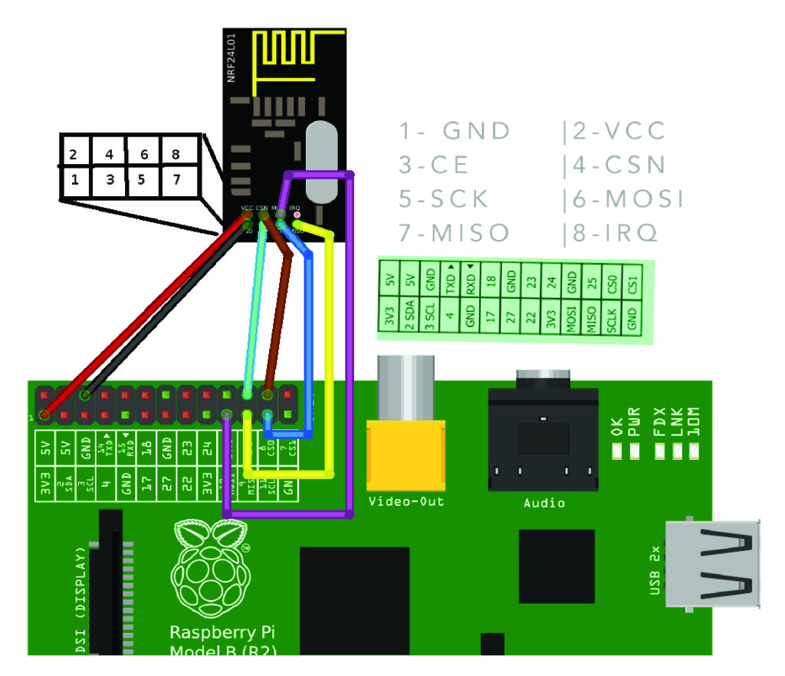

# Wireless Sensor Network Project

This is a sandbox for various projects related to setting up a wireless sensor
network of mainly battery-powered arduino nodes reporting back to a Raspberry
Pi as their gateway to the net.

The RPi records data from the nodes and provides a web interface to view node
data and interact with active nodes (switches, etc.).

## Raspberry Pi Scripts & Service

The Raspberry Pi is the central controller of our sensor network, so it should
have an always-running process listening for input and dispatching commands to
sensor nodes.

As of this writing (May 27, 2017), I have built a simple listener ('receive.py')
that accepts sensor data and appends it to a CSV file with a timestamp. The
'sensor-receiver.service' configuration for systemd can be used to auto-start
and manage this script.

## Requirements

 - Raspberry Pi Running Raspbian - This has only been tested on Raspbian Buster
 - Python 3.7+
 - nginx

The Python dependencies can be found in requirements.txt and installed with the
command:

    python3 -m pip install -t requirements.txt

## Installation

Install system-level dependencies:

    sudo apt-get install python-pip python-virtualenv nginx python-rpi.gpio python3-rpi.gpio

The Python code and configuration files are designed to run on debian-based
Linux (Raspbian, Ubuntu, etc.), so bear that in mind!

Clone the repository to your home server (raspberry pi or what-have-you). The
following commands assume you cloned it to your home (`~`) directory.

If it is not already installed, you will need `virtualenvwrapper` installed
under your global system Python:

    pip install virtualenvwrapper

Next, you need to add three lines to your shell startup file (.bashrc, .profile,
etc.) to set the location where the virtual environments should live, the
location of your development project directories, and the location of the script
installed with this package:

    export WORKON_HOME=$HOME/.virtualenvs
    export PROJECT_HOME=$HOME/Devel
    source /usr/local/bin/virtualenvwrapper.sh

After editing it, reload the startup file (e.g., run source ~/.bashrc).

You can now switch Python virtual environments using the `workon` command and
create new environments with the `mkvirtualenv` command.

Now you should be able to run the Python receiver:

    python3 receive.py

## Wire the NLRF24 Radio to the Raspberry Pi

But you won't receive any signals without a radio attached! Here is a diagram
illustrating how to connect the NLRF24 breakout board to the GPIO pins of an
old model Raspberry Pi (in this case a Raspberry Pi B, model 2011.12)

Source: https://www.14core.com/make-your-raspberry-pi-as-iot-internet-of-things-server-with-nrf24l01/

IMPORTANT NOTE: The GPIO pin that you choose to attach to the CE pin of the
radio is up to you. This diagram shows a connection to GPIO pin 25, but the
scripts in this project use GPIO pin 17.

## Set Up "Permanent" Processes

Here's how to set up the radio receiver and web dashboard services to run all
the time.

Create a symlink from `/opt` to the repository directory.

    sudo ln -s ~/home-sensors /opt/home-sensors

Install the nginx configuration:

    sudo ln -s ~/home-sensors/nginx/sensors.conf /etc/nginx/sites-available/
    sudo ln -s /etc/nginx/sites-available/sesnors.conf /etc/nginx/sites-enabled/

Install the systemd scripts:

    sudo cp ~/home-sensors/server/systemd/sensor-dashboard.service /lib/systemd/system/
    sudo cp ~/home-sensors/server/systemd/sensor-receiver.service /lib/systemd/system/ sudo
    systemctl enable sensor-dashboard sensor-receiver sudo systemctl start
    sensor-dashboard sensor-receiver

